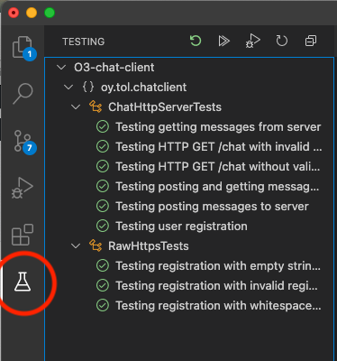
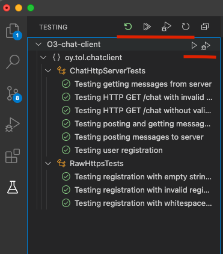

# Using the ChatClient JUnit tests

The necessary dependent components needed to run JUnit tests are already included in the `pom.xml` of the project.

The tests should be executed from the command line, since they are *parameterized*. All the necessary parameters
are in the three test setting XML files included in the project.

You can execute tests also from VS Code, but then it uses *only one* of the hard coded test parameter XML files `test-config-1.xml`.

In the Exercises 5 and especially 6, you *need* to run the tests from the command line. You execute the three tests 
from *three separate terminal windows* and three separate test configuration files.

The purpose of this is to execute three tests in parallel to check your server can handle at least moderate amount of
stress from the three test clients which all run tests in parallel in different threads.

[This video of four parallel tests](https://youtu.be/NmofffdPNf8) demonstrates how the tests are executed with the 
server. I also discuss analysing bugs found and how to deal with them. Video has essential topics subtitled in English.

## Where are the tests?

You can find the test source code files in `src/test` folder in your project. Test configurations for
command line testing are in the project root directory in the three `test-config-n.xml` files (where n is 1,2 or 3).

VS Code has a Test view you can select from the left side. The button reminds of a lab liquid bottle:



There you can see the tests. If not, use the Refresh button to refresh the view.

## How to configure the tests?

Tests are designed to work with different versions of your server. When you finish exercise 2, for example,
you can test it by changing the server version to `2`.

Also you need to provide the tests the same client side certificate file that you must give to the actual
ChatClient app. See instructions in [README.md](README.md) on how to do that.

Test configuration were previously changed in the file `ChatUnitTestSettings.java`. *Not anymore*. Now you do
not have to edit the code anymore to configure the tests. Just edit the XML test configuration files.

There are **three test configuration files** to edit, `test-config-1.xml`, `test-config-2.xml` and `test-config-3.xml`.

The contents of each file is similar:

```XML
<testconfig>
   <servercertificate>/Users/anttijuustila/workspace/O3/O3-chat-client/localhost.cer</servercertificate>
   <serverversion>5</serverversion>
   <user id="01">
      <username>antti</username>
      <password>juustila21</password>
   </user>
   <user id="02">
      <username>markus</username>
      <password>kelanti21</password>
   </user>
</testconfig>
```

Use these configuration items to change the test settings on your PC:

* The `servercertificate` must be set as mentioned earlier, and this path must be a full path to that certificate file on your PC.
* `serverversion` is the number of the exercise you are testing. If you have just finished exercise 2, this should be 2. When 
you have finished exercise 3, change this number to 3 in *all* of the test configuration files.
* `user` element contains `username` and `password` elements. Each test config file must have two separate users. You do not have to register the users manually to the server, the **tests will do that for you**. Just make sure that if your server checks the validity of the username and/or password, the information here is valid for your server (e.g. password is long enough).

Remember to edit all the three test configuration files when you change the test settings.

## How to run the tests?

Before using the tests, you obviously need to run the server.  After launching it, you can then execute the tests.

Make sure you configured the tests (above). Then you can run them. From command line, first build the client (if not already built):

```
mvn package -DskipTests
```

and then run a tests:

```
mvn test -Dtestsettings="test-config-1.xml"
```

If the test passes, then **execute all the three tests in parallel**. First, open **three** terminal windows for the three tests.

Then in each of the terminals, execute one test, and a different test in another. Here is a sample of what the test execution
commands look like:

```
mvn test -Dtestsettings="test-config-1.xml"
mvn test -Dtestsettings="test-config-2.xml"
mvn test -Dtestsettings="test-config-3.xml"
```

So one test in one terminal. You should write (do not press enter!) **one** of the test commands above in one terminal window. When you have a test command ready and waiting in all of the terminal windows, quickly press enter and switch from one window to
another so that the tests are run at the same time.

If your server can handle heavy loads, you should not see any errors in the tests.

You should be able to run the tests starting with an **empty database**. If you do that, and execute three tests in three
terminal windows **once**, you should have 989 chat messages in the database after the tests end:

```
sqlite> select count(*) from messages;
989
sqlite>
```

## Testing in VS Code

If your VS Code does not have the necessary Extensions to test Java apps, see this VS Code help page:

[https://code.visualstudio.com/docs/java/java-testing](https://code.visualstudio.com/docs/java/java-testing)

For an overview of the testing using VS Code, see [this video](https://youtu.be/ZO2aJSiDRSw) (Finnish only).

In Visual Studio Code, select the Test view, then select the Run Tests button (triangle pointing right):

 

It executes all of the tests with one hard coded test configuration `test-config-1.xml`. If you want to run just one of the tests, hover your mouse over the test and select the Run test (triangle pointing right).

When the tests pass, the test symbol is green "OK". When it is red, the test fails. You should then analyse the situation and
think why the test failed and what you should change in your server to fix the situation.

**Note** that the `HttpHeaderTests` and `ParallelTests` are only run when server version is 5 or above.

**Note** That if the server is already implementing things from Exercise 3, for example, but the `serverVersion` in the tests is
2, for example, then the tests may fail. So you must configure the tests correctly, telling version of the server you are testing.

## Questions?

Discuss at the course Slack workspace and show up in the exercise sessions.

## Contact info

* Antti Juustila
* INTERACT Research Unit, University of Oulu, Finland

